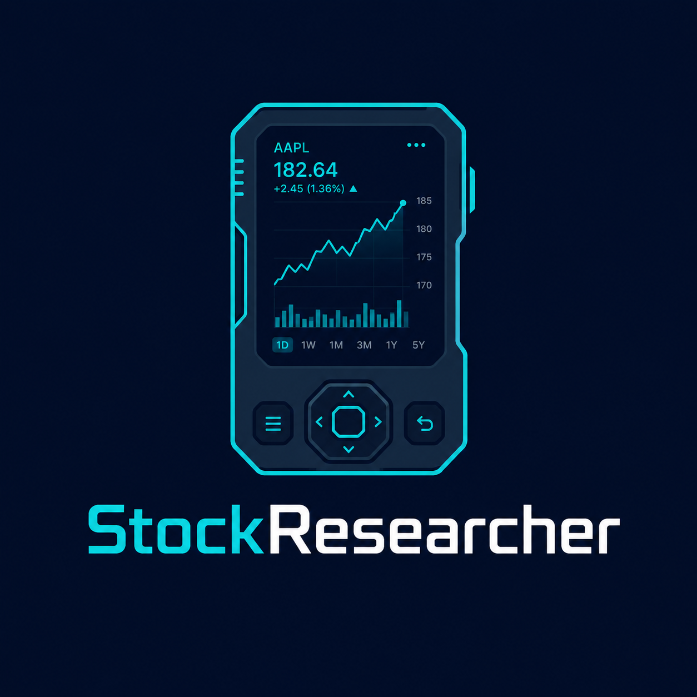

<p align="center">
  
</p>

A self-hosted stock screening tool for swing traders. Scores a watchlist of stocks using RSI, moving average crossover, momentum, and relative volume — then ranks them by buy signal strength. Includes paper trading, price alerts, and a watchlist editor. No API key, no brokerage account, no real money.

**Data:** Yahoo Finance (delayed/end-of-day, free).  
**License:** MIT — see [LICENSE](LICENSE).

---

## Setup

**Requirements:** Python 3.11+ · Windows, Mac, or Linux

1. Clone or download the repo
2. Double-click **`start.bat`** (Windows) or run **`./start.sh`** (Mac/Linux)

The script creates a virtual environment, installs dependencies, and starts the server. On first load you'll be prompted to create a username and password — credentials are stored locally in `db/trades.db`.

Open **http://localhost:8000** in your browser. Other devices on your network can reach it at the IP printed in the terminal (e.g. `http://192.168.1.42:8000`).

Click **Refresh Data** in the nav to fetch and score your watchlist. The first run takes 1–3 minutes (one API call per ticker). After that, data is cached for 8 hours.

---

## Autostart on Windows login

Right-click **`install-autostart.bat`** → **Run as administrator**

This registers a Task Scheduler task that starts the server automatically 90 seconds after login. To remove it, run `uninstall-autostart.bat`.

**Check if the server is running:**
```powershell
Get-NetTCPConnection -LocalPort 8000 -ErrorAction SilentlyContinue
```
A result with `State: Listen` means it's up.

**Desktop shortcut with custom icon:** double-click **`create-shortcut.bat`**.

---

## Configuration

Edit [`config.py`](config.py) to change scoring weights, account size, cache TTL, or the default watchlist. The watchlist is also editable from the **Settings** page in the app.

---

## How scoring works

Each stock is scored 0–100 from four indicators:

| Indicator | Signal |
|---|---|
| RSI (14-day) | Below 40 = oversold = bullish |
| MA Crossover | 20-day above 50-day = uptrend |
| 20-day Momentum | Positive price change |
| Relative Volume | Above 1.5× 20-day average |

Risk flags (low liquidity, high volatility, overbought, earnings soon) are shown alongside each score but don't affect ranking.

---

## Disclaimer

This tool is for personal research and education only. It does not execute trades or manage real money. All data is delayed and sourced from Yahoo Finance. Technical indicators are heuristics — they do not guarantee future price movement or profitable trades. You can and may lose money. Always do your own research before investing.
